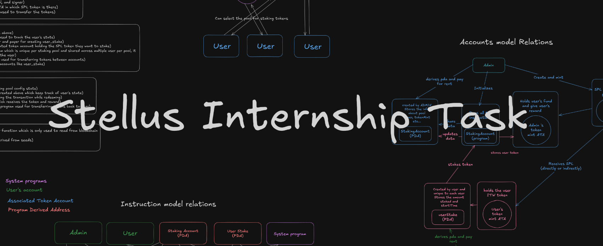

# Setup guide

## Prerequisites

- Node.js
- bun (optional)
- anchor-cli
- solana-cli
- make (optional)
- **Make sure to have the private key of the admin account in the `~/.config/solana/id.json` file**

In this setup we are going to use `bun` as a package manager. You can also use `yarn` or `npm` as a package manager. But you'll need to change the commands accordingly.

1. Clone the repo
   ```sh
   git clone https://github.com/ArshilHapani/stellus_internship_assesment_task
   cd stellus_internship_assesment_task
   ```
2. Install the bun (recommended)
   ```sh
   bun install
   ```
3. Setup the project

   ```sh
   anchor build
   ```

4. Run the tests

   ```sh
   anchor test
   ```

5. Deploy the program

   ```sh
   anchor run deploy
   ```

## Setup client

1. Go to the client directory

   ```sh
   cd app
   ```

2. Install the dependencies

   ```sh
   bun install
   ```

3. Create the .env file

   ```sh
   cp .env.example .env
   ```

   Update the .env file with the correct values

4. Migrate the types

   ### If you have make installed

   ```sh
   cd .. && make migrate-types && cd app
   ```

   ### If you don't have make installed

   ```sh
   chmod +x ../scripts/generateTypes.sh
   ../scripts/generateTypes.sh
   ```

5. Start the client
   ```sh
   bun run dev
   ```

## Assumptions

There is hardcoded address of admin in `app/src/lib/constants.ts`. You can change it to your own address.

## Explanations

- [notion site](https://arshil.notion.site/Stellus-Interview-Task-16049225fb4580ed9205fb12e0b9f03d)
